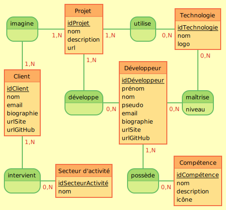
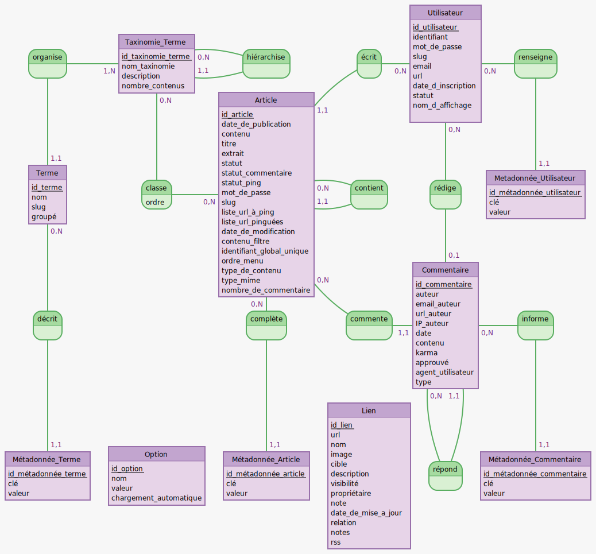

# Gestion des données avec WordPress

## Modèle conceptuel de données (MCD)

### oProfile

### WordPress

[Voir le diagramme EER MySQL](wordpress-eer.png)

---

## Entités

Nom|Table WordPress|Détail(s)
-|-|-
Client|`users`|role `client`
Compétence|`terms`| taxonomy `skill`
Développeur|?|?
Projet|?|?
Secteur d'activité|?|?
Technologie|?|?

---

## Propriétés (Attributs)

### Client / Entreprise

Propriété|Table WordPress|Colonne|Détail(s)
-|-|-|-
idClient|`users`|`ID`|
nom|`users`|`user_nicename`|
email|`users`|`user_email`|
biographie|`usermeta`|`meta_value`|`meta_key` = `description`
urlSite|`user`|`user_url`|
urlGitHub|`usermeta`|`meta_value`|`meta_key` =  `github_url`

### Compétence

Propriété|Table WordPress|Colonne|Détail(s)
-|-|-|-
idCompétence|`terms`|`term_id`|
nom|`terms`|`name`|
description|`term_taxonomy`|`description`|
icône|`termmeta`|`meta_value`|`meta_key` = `icon`

### Développeur

Propriété|Table WordPress|Colonne|Détail(s)
-|-|-|-
idDéveloppeur|?|?|?
prénom|?|?|?
nom|?|?|?
pseudo|?|?|?
email|?|?|?
biographie|?|?|?
urlSite|?|?|?
urlGitHub|?|?|?

### Projet

Propriété|Table WordPress|Colonne|Détail(s)
-|-|-|-
idProjet|?|?|?
nom|?|?|?
description|?|?|?
url|?|?|?

### Secteur d'activité

Propriété|Table WordPress|Colonne|Détail(s)
-|-|-|-
idSecteurActivite|?|?|?
nom|?|?|?

### Technologie

Propriété|Table WordPress|Colonne|Détail(s)
-|-|-|-
idTechnologie|?|?|?
nom|?|?|?
logo|?|?|?

---

## Associations

Entité 1|Nom|Entité 2|Table WordPress|Colonne entité 1|Colonne entité 2|Détail(s)
-|-|-|-|-|-|-
Client|invervient|Secteur d'activité|?|?|?|?
Client|imagine|Projet|?|?|?|?
Développeur|développe|Projet|?|?|?|?
Développeur|maîtrise|Technologie|`developer_technology_relationships`|`developer_id`|`technology_id`|**Table personnalisée**
Développeur|possède|Compétence|?|?|?|?
Projet|utilise|Technologie|?|?|?|?

---

## Propriétés (Attributs) d'association

Entité 1|Nom|Entité 2|Table|Colonne|Détail(s)
-|-|-|-|-|-
Développeur|maîtrise|Technologie|`developer_technology_relationships`|`level`|Valeurs possibles : Débutant, Confirmé, Expert
