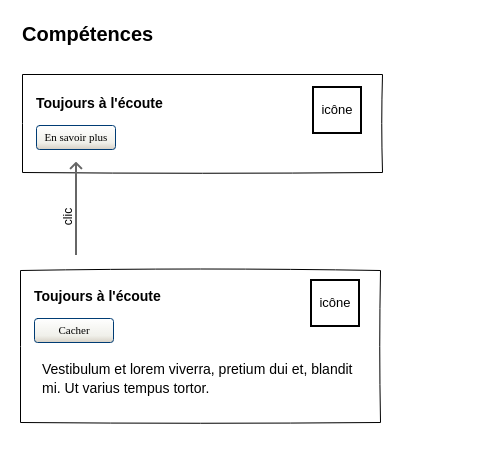
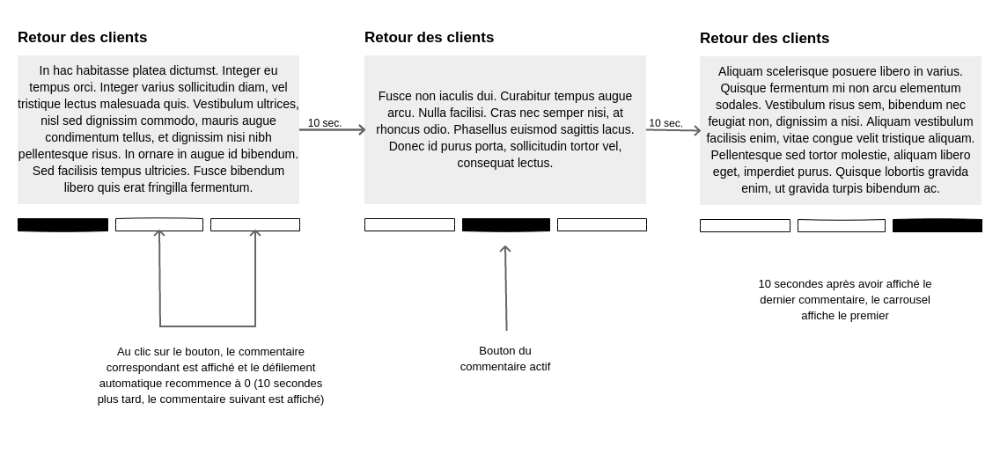

# UX

## Compétences

Sur un écran au maximum de taille medium, les compétences n'affichent pas leur description. Un bouton la remplace et au clic dessus, la description s'affiche.

## En-tête

Par défaut, l'en-tête s'affiche tout en haut de la page.
Sur la page d'**accueil**, quand on **sort de la banière**, le header passe en **position fixe** avec un **dégradé de couleur du bleu vers le violet** en fond ([pour plus de détails, voir la documentation de l'UI](../ui/)).
Sur la page de **profil**, l'en-tête passe en **position fixe** avec dégradé quand on **sort de la présentation du développeur**.

## Commentaire de profil

Les commentaires s'affichent sous la forme d'un **carrousel**.
Les commentaires défilent toutes les **10 secondes**.
Une navigation permet de changer manuellement de commentaire.

